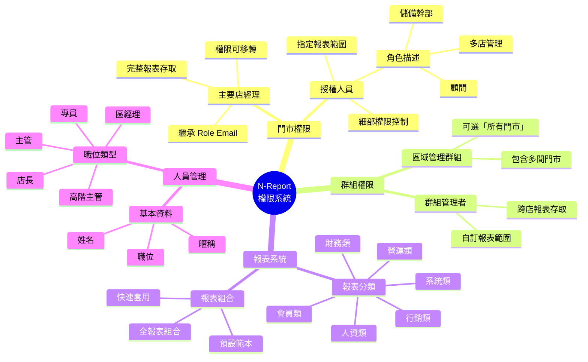
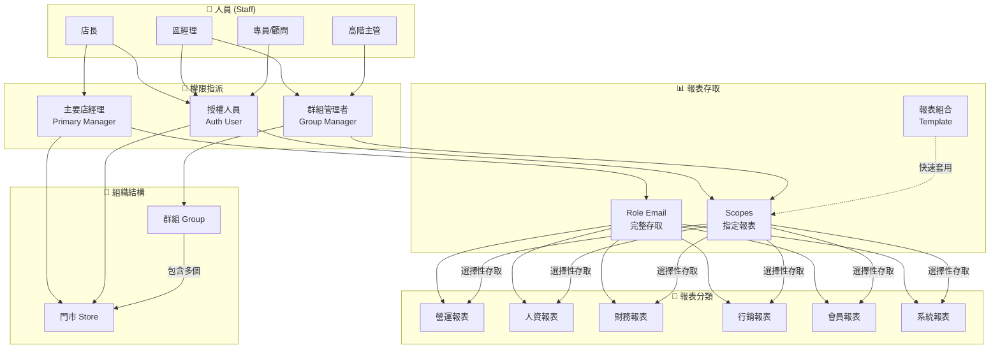
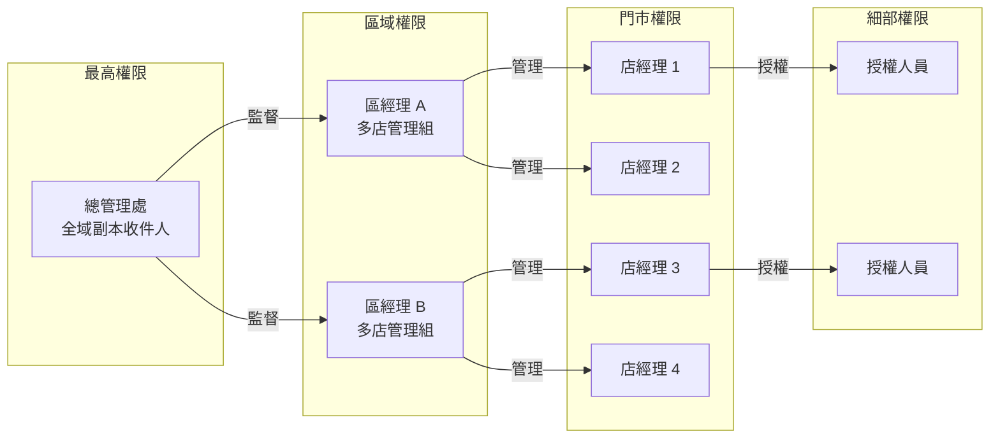
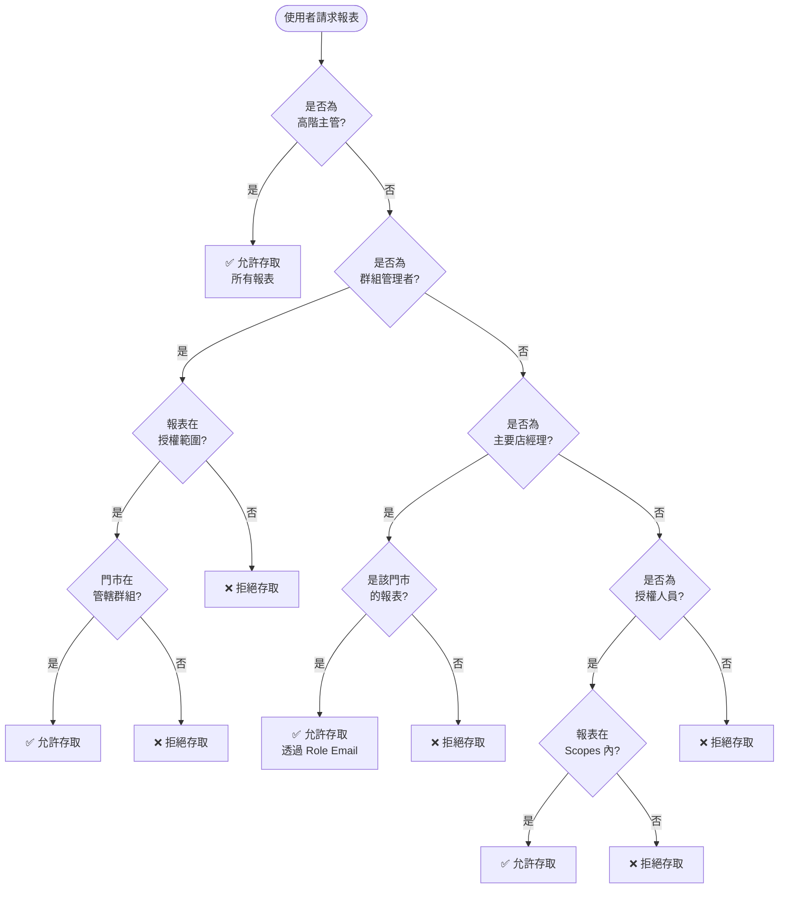
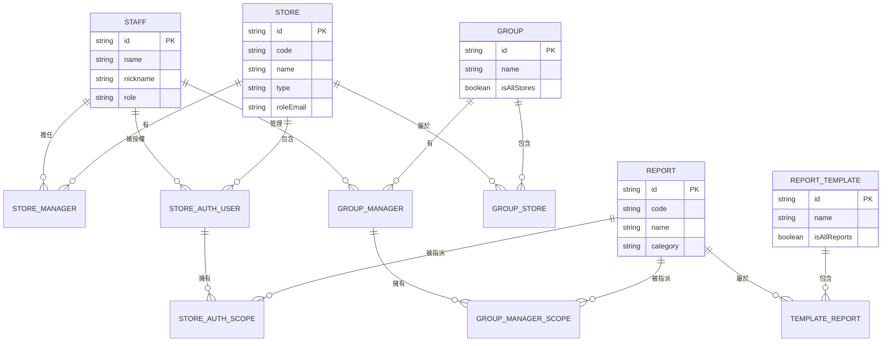

# N-Report 權限邏輯關係心智圖

## 視覺化心智圖 (Mermaid)



---

## 權限流向圖 (Mermaid Flowchart)



---

## 權限繼承關係圖



---

## 文字版心智圖

```
                                    ┌─────────────────────────────────────┐
                                    │      N-Report 權限系統              │
                                    └─────────────────┬───────────────────┘
                                                      │
            ┌─────────────────────┬───────────────────┼───────────────────┬─────────────────────┐
            │                     │                   │                   │                     │
            ▼                     ▼                   ▼                   ▼                     ▼
    ┌───────────────┐     ┌───────────────┐   ┌───────────────┐   ┌───────────────┐     ┌───────────────┐
    │   門市權限     │     │   群組權限     │   │   報表系統     │   │   人員管理     │     │   報表組合     │
    └───────┬───────┘     └───────┬───────┘   └───────┬───────┘   └───────┬───────┘     └───────┬───────┘
            │                     │                   │                   │                     │
    ┌───────┴───────┐     ┌───────┴───────┐   ┌───────┴───────┐   ┌───────┴───────┐     ┌───────┴───────┐
    │               │     │               │   │               │   │               │     │               │
    ▼               ▼     ▼               ▼   ▼               ▼   ▼               ▼     ▼               ▼
┌────────┐    ┌────────┐ ┌────────┐  ┌────────┐ ┌────────┐  ┌────────┐ ┌────────┐  ┌────────┐ ┌────────┐  ┌────────┐
│主要    │    │授權    │ │區域    │  │群組    │ │營運類  │  │人資類  │ │姓名    │  │職位    │ │營運    │  │人資    │
│店經理  │    │人員    │ │管理    │  │管理者  │ │報表    │  │報表    │ │暱稱    │  │類型    │ │管理    │  │報表    │
└────┬───┘    └────┬───┘ │群組    │  └────┬───┘ ├────────┤  ├────────┤ └────────┘  ├────────┤ │組合    │  │組合    │
     │             │     └────────┘       │     │財務類  │  │行銷類  │             │店長    │ └────────┘  └────────┘
     │             │                      │     │報表    │  │報表    │             │區經理  │
     ▼             ▼                      │     ├────────┤  ├────────┤             │主管    │
┌────────────┐ ┌────────────┐             │     │會員類  │  │系統類  │             │高階主管│
│繼承        │ │細部權限    │             │     │報表    │  │報表    │             │專員    │
│Role Email  │ │控制       │             │     └────────┘  └────────┘             └────────┘
│完整報表    │ │指定報表   │             │
│存取        │ │範圍       │             ▼
└────────────┘ └────────────┘     ┌────────────────┐
                                 │跨店報表存取    │
                                 │自訂報表範圍    │
                                 └────────────────┘
```

---

## 權限矩陣表

| 角色 | 門市存取 | 報表範圍 | Role Email | 群組管理 | 說明 |
|------|---------|---------|------------|---------|------|
| **高階主管** | 所有門市 | 全部報表 | ✓ 副本 | ✓ | 全域監督權限 |
| **區經理** | 管轄門市群組 | 自訂範圍 | ✗ | ✓ | 多店管理 |
| **主要店經理** | 單一門市 | 全部報表 | ✓ 主要 | ✗ | 門市完整權限 |
| **授權人員** | 單一門市 | 指定報表 | ✗ | ✗ | 細部權限 |
| **專員/顧問** | 指定門市 | 指定報表 | ✗ | ✗ | 特定任務 |

---

## 權限判斷流程



---

## 實際案例說明

### 案例 1：Tina (區經理) 的權限範圍

```
吳佳蓉 Tina (區經理)
    │
    ├── 主要店經理身份
    │   └── 板橋光澤醫美 ──→ Role Email: dr.shine.manager1@gmail.com
    │                        └── 全部報表存取權
    │
    └── 多店管理群組
        ├── 忠孝光澤
        ├── 三峽光澤診所
        ├── 板橋岩盤浴
        └── 忠孝岩盤浴
            └── 各門市指定報表範圍
```

### 案例 2：全域副本收件人

```
全域副本收件人群組
    │
    ├── 包含：(所有門市)
    │
    └── 管理者
        ├── 協理 ──────→ 全部報表
        ├── William ───→ 全部報表
        └── Arthur ────→ 全部報表
```

---

## 資料關聯圖 (ER Diagram)



---

## 快速參考卡

```
╔══════════════════════════════════════════════════════════════════╗
║                    N-Report 權限快速參考                          ║
╠══════════════════════════════════════════════════════════════════╣
║                                                                  ║
║  📍 門市權限                                                      ║
║     • 主要店經理 = Role Email + 全報表                            ║
║     • 授權人員 = 指定報表 (Scopes)                                ║
║                                                                  ║
║  📦 群組權限                                                      ║
║     • 群組 = 多個門市的集合                                       ║
║     • 群組管理者 = 跨店 + 指定報表                                ║
║                                                                  ║
║  📋 報表組合                                                      ║
║     • 預設範本快速套用                                            ║
║     • 空陣列 = 全部報表                                           ║
║                                                                  ║
║  🔄 權限優先級                                                    ║
║     高階主管 > 群組管理者 > 主要店經理 > 授權人員                   ║
║                                                                  ║
╚══════════════════════════════════════════════════════════════════╝
```
